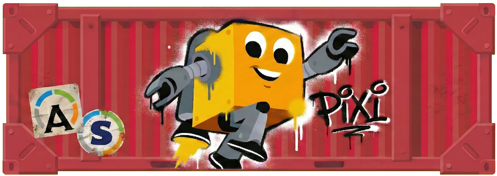

# Pixitainer

[](https://pixi.sh)
[](LICENSE)
[](https://prefix.dev/channels/raphaelribes/packages/pixitainer)

*This banner placeholder was generated by [Gemini 3 Banana Pro](https://gemini.google.com) using already made asset like the pixi, apptainer and singularity logo*
## Why ...

### pixi ?

Pixi is a fast, easy and fun to use tool that allows you to manage multiple dependencies in multiple environment very easily.
It has a great support either by its developers or community on [discord](https://discord.gg/A94bgPENFD).

### using containers ?

Singularity/Apptainer is very used in bioinformatics, it's at the hearth of analyzes pipelines, but it's a headache to put in place.
In another hand, pixi is fast, easy to use, but it's not a container and so harder to keep intact for a long period of time.
The idea behind pixitainer is to put a pixi environment into an Apptainer container, so you can freeze your fast pace working environment into a container easily !

### Apptainer ?

Apptainer is more the "public library" version of the software, while Singularity is more like a "corporate bookstore."
Because Apptainer is hosted by the Linux Foundation, it is designed specifically for the scientific community to ensure that your research code remains free, accessible and without being tied to a private company’s profit goals.

## How ?
The best thing to do will be to add this way as a [pixi extension](https://pixi.sh/latest/integration/extensions/introduction/), so we just have to type `pixi containerize`, some option and tada !

TODO:
- [x] Receipe that works.
- [x] Pixi package that I can add as an extension.
- [x] Adding options to the extension.
  - [x] Build options
    - [x] Seamless mode (`-s`, `--seamless`)
    - [x] Specific environment selection (`-e`, `--env`)
    - [x] Specify base image (`--base-image`)
    - [x] Specify pixi version (`--pixi-version`)
    - [x] Export the `.def` file (`--keep-def`)
    - [x] Verbose mode (`--verbose`)
- [ ] Support of container solutions 
   - [x] Apptainer
   - [ ] Singularity
   - [ ] Docker
    > Note that by default pixitainer is made with Apptainer in mind so it will be an option to install other container solutions.
- [x] Testings.
- [x] Publish
- [ ] Go back to step 3 until WW3, messiah or death of the internet

# How to install
0. Install pixi
```bash
curl -fsSL https://pixi.sh/install.sh | sh
```
## User

Simply install pixitainer globaly on pixi:
```bash
pixi global install pixitainer
```

## Developer
1. Clone this repo
```bash
git clone https://github.com/RaphaelRibes/pixitainer.git
cd pixitainer
```

You have two ways of using it, I recommend for now that you just add it to your path
```bash
export PATH=$PWD:$PATH
```

If you want to build it tho, do this:

1. Install rattler
```bash
pixi global install rattler-build
```

2. Build the pixitainer extension
```bash
rattler-build build --recipe recipe.yaml --output-dir $(pwd -P)/output
```

3. Install the pixitainer extension
```bash
pixi global install pixitainer --channel $(pwd -P)/output --channel conda-forge
```

# How to use

You actually have two ways of using pixitainer:
1. Manually
2. Seamlessly

We put ourselves in an environment with one task defined like
```yaml
[tasks]
make_dir = 'mkdir testdir'
```

## Manually
You can also build the container manually with apptainer
```bash
pixi containerize
```

Then you can use pixi in your image
```bash
apptainer run -f pixitainer.sif pixi run --as-is -m /opt/conf/pixi.toml make_dir
```

We add `--as-is` to make sure it sticks to the `pixi.lock` file and it only uses the installed binaries and doesn't try to install others.

> **WARNING**: `-m /opt/conf/pixi.toml` is mandatory or pixi will use the default one in your current working directory.

## Seamlessly
Just use the pixitainer extension command after installing it with the seamless option (`-s`, `--seamless`).
```bash
pixi containerize -s
```

You can then turn your task like pixi is not even here
```bash
apptainer run -f pixitainer.sif make_dir
```

> **WARNING**: the seamless mode makes that every commands run through the image are ran like so
> ```bash
> pixi run --as-is -m /opt/conf/pixi.toml "$@"
> ```
> Meaning that you only have access to `pixi run` and nothing else.


# Known problems

## Pathing is... strange?

When launching a command in the pixi shell, the `cwd` of tasks will be changed into the one of the pixi workplace (`PIXI_PROJECT_ROOT`).

Let's create a task
```yaml
[tasks]
make_dir = 'mkdir testdir'
```
If you run this task, it's going to create `$PIXI_PROJECT_ROOT/testdir` (`/opt/conf/testdir`) and not `$INIT_CWD/testdir` (`$(pwd)/testdir`).
What you want is to run pixi in the `INIT_CWD` so take the time to change your `./something` to `$INIT_CWD/something`.

## Read-only file system (os error 30)

This is related to the previous problem: pixi is using `PIXI_PROJECT_ROOT` as the `cwd`. 
It's going to try to write in `/opt/conf` wich is not allowed because the sif image is in read only.
To fix it, replace your `mkdir test` byt `mkdir $INIT_CWD/test`.

However, sometimes pixi may write something in its cache so don't hesitate to use `--writable-tmpfs`.
