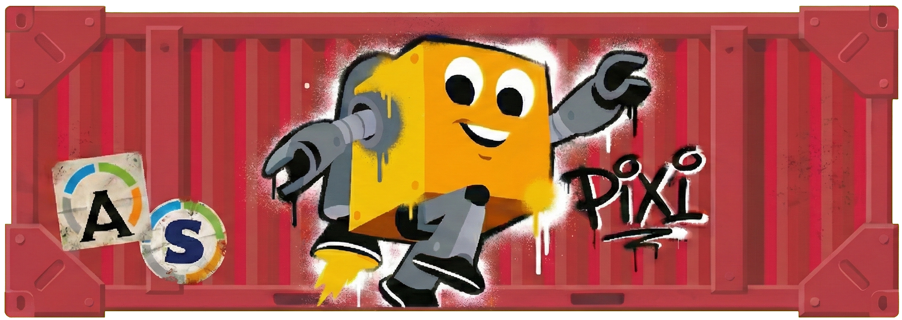

# Pixitainer


[](https://pixi.sh)
[](LICENSE)
[](https://prefix.dev/channels/raphaelribes/packages/pixitainer)
[](https://doi.org/10.5281/zenodo.19698995)



*This banner placeholder was generated by [Gemini 3 Banana Pro](https://gemini.google.com) using already made assets like the pixi, apptainer and singularity logo*

## Why...

### ...pixi ?

Pixi is a fast, easy and fun to use tool that allows you to manage dependencies across multiple environments very easily.
It has great support from its developers and community on [discord](https://discord.gg/A94bgPENFD).

### ...using containers ?

Singularity/Apptainer is widely used in bioinformatics, it's at the heart of analysis pipelines, but it's a headache to set up.
On the other hand, pixi is fast and easy to use, but it's not a container and is harder to keep intact over long periods.
The idea behind pixitainer is simple: put a pixi environment into an Apptainer container, so you can freeze your fast-paced working environment into a portable image!

## Apptainer vs Singularity

Apptainer is more the "public library" version of the software, while Singularity is more like a "corporate bookstore."
Because Apptainer is hosted by the Linux Foundation, it is designed specifically for the scientific community to ensure that your research code remains free, accessible and without being tied to a private company’s profit goals.

Singularity is often found on high-performance computing (HPC) clusters and is maintained by Sylabs. Pixitainer supports both!

## Projects using pixitainer

- [FastDedup](https://github.com/RaphaelRibes/FDedup.git) a PCR deduplication tool written in Rust optimized for speed and low memory usage.

## How to install

1. Install pixi

```bash
curl -fsSL https://pixi.sh/install.sh | sh
```

Install pixitainer (Apptainer), pixitainer-singularity (Singularity) or pixitainer-docker (Docker) globaly on pixi:

```bash
# For Apptainer
pixi global install -c https://prefix.dev/raphaelribes -c https://prefix.dev/conda-forge pixitainer

# For Singularity
pixi global install -c https://prefix.dev/raphaelribes -c https://prefix.dev/conda-forge pixitainer-singularity

# For Docker
pixi global install -c https://prefix.dev/raphaelribes -c https://prefix.dev/conda-forge pixitainer-docker
```

### Developer

1. Clone this repo

```bash
git clone https://github.com/RaphaelRibes/pixitainer.git
cd pixitainer
```

2. Build the pixitainer extension

```bash
pixi build
```

3. Install the pixitainer extension

```bash
# Apptainer
pixi global install pixitainer --path pixitainer-0.8.0*.conda --channel conda-forge

# Singularity
pixi global install pixitainer-singularity --path pixitainer-singularity-0.8.0*.conda --channel conda-forge

# Docker
pixi global install pixitainer-docker --path pixitainer-docker-0.8.0*.conda --channel conda-forge
```

## How to use

There are two ways of using pixitainer:

1. Seamlessly (default)
2. Manually (`-m`, `--manual`)

We put ourselves in an environment with one task defined like

```yaml
[tasks]
make_dir = 'mkdir testdir'
```

### Seamlessly (default)

Seamless execution is the default, so no flag is needed.

```bash
# For Apptainer
pixi containerize

# For Singularity
pixi containerize-singularity

# For Docker
pixi containerize-docker
```

You can then run your task like pixi is not even here

```bash
# Apptainer
apptainer run -f pixitainer.sif make_dir

# Singularity
singularity run -f pixitainer.sif make_dir

# Docker
docker run --rm <your_image_name>:latest make_dir
```

> **WARNING**: in seamless mode, every command run through the image is executed like so
>
> ```bash
> pixi run --locked --as-is -m /opt/conf/pixi.toml "$@"
> ```
>
> Meaning that you only have access to `pixi run`. Use `--manual` if you need a raw shell entrypoint.

### Manually (`-m`, `--manual`)

Pass `-m` / `--manual` to get a plain shell entrypoint instead, so you invoke `pixi` yourself.

```bash
# For Apptainer
pixi containerize --manual

# For Singularity
pixi containerize-singularity --manual

# For Docker
pixi containerize-docker --manual
```

Then you call pixi inside your image

```bash
# Apptainer
apptainer run -f pixitainer.sif pixi run --as-is -m /opt/conf/pixi.toml make_dir

# Singularity
singularity run -f pixitainer.sif pixi run --as-is -m /opt/conf/pixi.toml make_dir

# Docker
docker run --rm <your_image_name>:latest pixi run --as-is -m /opt/conf/pixi.toml make_dir
```

We add `--as-is` to make sure it sticks to the `pixi.lock` file, and it only uses the installed binaries and doesn't try to install others.

> **WARNING**: `-m /opt/conf/pixi.toml` is mandatory or pixi will use the default one in your current working directory.

## Containerizing a single tool (`tool`)

Since **v0.8.0**, you can containerize one or more conda packages directly with `pixi global install`, **without needing a `pixi.toml` or `pixi.lock`**. The `tool` subcommand can be run from anywhere on your system.

```bash
# Apptainer
pixi containerize tool python                 # -> python.sif
pixi containerize tool -c bioconda fastp      # -> fastp.sif

# Singularity
pixi containerize-singularity tool -c bioconda samtools

# Docker
pixi containerize-docker tool -c bioconda fastp   # -> fastp:latest
```

Packages use the conda MatchSpec syntax, so you can pin versions inline, like for pixi packages:

```bash
pixi containerize tool 'python>=3.11'
```

You can install several packages into one image (each gets its own global environment, all binaries exposed):

```bash
pixi containerize tool -c bioconda samtools bcftools
```

The image name defaults to the (first) package name (`<package>.sif` for SIF, `<package>:latest` for Docker). Override it with `-o/--output`:

```bash
pixi containerize tool -c bioconda fastp -o images/fastp-0.23.sif
pixi containerize-docker tool -c bioconda fastp -o myregistry/fastp:0.23
```

Then run the tool from the image. By default the tool's binary is the entrypoint, so you run it directly:

```bash
apptainer run fastp.sif fastp --version
docker run --rm fastp:latest fastp --version
```

> **Note**: with several packages (e.g. `tool samtools bcftools`) there is no single binary to bind, so the image falls back to the manual entrypoint automatically; run each tool by name.

### `tool` options

| Option                                | Meaning                                                                                                                                                   |
|---------------------------------------|-----------------------------------------------------------------------------------------------------------------------------------------------------------|
| `-c, --channel CHAN`                  | Channel to pull from (repeatable, default `conda-forge`). When you set a channel, `conda-forge` is auto-appended if missing, since most packages need it. |
| `-o, --output`                        | Output `.sif` path / Docker tag. Defaults to the package name.                                                                                            |
| `-m, --manual`                        | Use a shell entrypoint instead of the tool binary. By default the package's binary is the image entrypoint, so you run the tool directly.                 |
| `-b, --base-image`                    | Base image (default: `debian:stable-slim`, a small glibc base).                                                                                           |
| `-V, --pixi-version` / `-L, --latest` | Pixi version selection (same as project mode).                                                                                                            |
| `-a, --add-file SRC:DEST`             | Add an extra file/folder to the image (repeatable).                                                                                                       |
| `--post-command CMD`                  | Run an extra command after install (repeatable).                                                                                                          |
| `-l, --label KEY:VALUE`               | Add a custom label (repeatable).                                                                                                                          |
| `-k, --keep-def`                      | Keep the generated `.def` / `Dockerfile`.                                                                                                                 |
| `-d, --dry-run`                       | Print the `.def` / `Dockerfile` without building.                                                                                                         |
| `-q, --quiet` / `-v, --verbose`       | Output verbosity.                                                                                                                                         |

Pin a version with the MatchSpec syntax (`fastp=0.23.4`, `'python>=3.11'`) rather than a dedicated flag.

### Keeping `tool` images small

`tool` images are optimised for size automatically:

- The default base is `debian:stable-slim` rather than a host-matched image. Since every package comes from conda, the base OS is irrelevant, so a small glibc base is used (override with `-b`).
- The pixi download cache (`~/.cache/rattler`) is removed after install. In containers this cache is copied rather than hard-linked, so dropping it is a large saving.
- The pixi binary itself is removed: it is only needed at build time. The exposed tool binaries are standalone trampolines under `/opt/pixi/bin`, so they keep working without it.
- For Docker, install and cleanup happen in a single layer, so the cache, the pixi binary and the build-time `curl` never persist in a lower layer.

If you need to trim further (for example stripping `man`/`include`/`*.a` from the env), add a `--post-command`, keeping in mind that compiler-like tools may need those files.

> **WARNING**: inside `tool` mode, `-c` means `--channel` (not `--post-command`). Use the long form `--post-command` for post commands. This differs from the manifest-based commands, where `-c` is `--post-command`.

> **Note**: `tool` mode does not read the `[tool.pixitainer]` TOML tables, since it is meant to run standalone without a project manifest.

## TOML Configuration

Since **v0.6.0**, you can configure pixitainer options directly in your project manifest (`pixi.toml` or `pyproject.toml`). Since **v0.7.0**, the configuration supports a three-tier priority system.

### Priority order (lowest → highest)

```
[tool.pixitainer]  <  [tool.pixitainer.<backend>]  <  CLI arguments
```

### `[tool.pixitainer]` — shared defaults

Keys placed here apply to **all backends** (Apptainer, Singularity, Docker) unless overridden.

```toml
[tool.pixitainer]
output = "my_image.sif"
base-image = "ubuntu:24.04"
manual = false   # default; set true for a raw shell entrypoint
env = ["default"]
add-file = ["data/config.yaml:/opt/config.yaml"]
post-command = ["echo 'Setup done' > /opt/setup.log"]
label = ["APP_VERSION:1.0.0", "AUTHOR:me"]
keep-def = false
dry-run = false
quiet = false
verbose = false
pixi-version = "0.64.0"
```

### `[tool.pixitainer.apptainer]` / `[tool.pixitainer.singularity]` / `[tool.pixitainer.docker]` — backend overrides

Keys placed in a backend-specific table **override** the matching key from `[tool.pixitainer]` for that backend only. Scalar keys fully replace the general value. **Array keys (`env`, `add-file`, `post-command`, `label`, and the Docker-specific arrays) fully replace** the general array — they are not merged or appended.

```toml
[tool.pixitainer]
output = "my_image.sif"
base-image = "ubuntu:24.04"
manual = false
label = ["AUTHOR:me"]

# When running `pixi containerize` (Apptainer):
# output → "my_apptainer.sif", label → ["AUTHOR:me", "APPTAINER:yes"]
[tool.pixitainer.apptainer]
output = "my_apptainer.sif"
label = ["AUTHOR:me", "APPTAINER:yes"]

# When running `pixi containerize-docker`:
# output → "my_image" (tag), user → "nobody", label stays ["AUTHOR:me"] from general
[tool.pixitainer.docker]
output = "my_image"
user = "nobody"
```

Docker-specific keys that are only valid under `[tool.pixitainer.docker]`:

```toml
[tool.pixitainer.docker]
output = "my_image:latest"
user = "nobody"
workdir = "/workspace"
no-cache = false
push = false
squash = false
platform = "linux/amd64"
network = "host"
save = "my_image.tar.gz"
build-arg = ["KEY=value"]
secret = ["id=token,src=/path/to/token"]
ssh = ["default"]
tag = ["registry.example.com/my_image:latest"]
cache-from = ["type=registry,ref=ghcr.io/me/img:cache"]
cache-to = ["type=inline"]
```

> **Note**: All keys mirror the long-form CLI option names (without the `--` prefix). Boolean options use `true`/`false`, and array options use TOML array syntax.

### CLI overrides everything

Command-line arguments always win over both TOML tables. This lets you define sensible defaults in your manifest and override them on a per-build basis:

```bash
# Uses TOML defaults, but overrides the output path
pixi containerize -o custom_output.sif
```

## Known problems

### Pathing is... strange?

When launching a command in the pixi shell, the task's working directory changes to the pixi project root (`PIXI_PROJECT_ROOT`).

Let's create a task

```yaml
[tasks]
make_dir = 'mkdir testdir'
```

If you run this task, it creates `$PIXI_PROJECT_ROOT/testdir` (`/opt/conf/testdir`) rather than `$INIT_CWD/testdir` (`$(pwd)/testdir`).
To work around this, prefix your paths with `$INIT_CWD/` instead:

```bash
make_dir = 'mkdir $INIT_CWD/testdir'
```

> **Note**: The container now defaults to `/opt/conf` as the working directory (`pwd -P` returns `/opt/conf`).
> This ensures compatibility with internal path resolutions, but you should rely on `$INIT_CWD` for input/output relative to where you run the container.
> If you have files to import in the container (ex: your build) you can put it in `/opt/conf` and it will allow normal execution.
> However, be conscious that your outputs will also be in `/opt/conf` and not in your current working directory.
> Since you cannot write in a container, you will have to specify the outputs with `$INIT_CWD` and bind the folder where you want your outputs to be.

### Read-only file system (os error 30)

This is related to the previous problem: pixi is using `PIXI_PROJECT_ROOT` as the `cwd`.
It will try to write in `/opt/conf` which is not allowed because the SIF image is in read-only mode.
To fix it, replace `mkdir test` by `mkdir $INIT_CWD/test`.

However, sometimes pixi may write something in its cache so don't hesitate to use `--writable-tmpfs`.

### Failed to create mount namespace

On Debian-based distros like Ubuntu, you may get this error message. My solution was to add an alias to `.bashrc`:
```sh
alias fixnamespace="sudo sysctl -w kernel.unprivileged_userns_clone=1 && sudo sysctl -w kernel.apparmor_restrict_unprivileged_userns=0"
```
Running `fixnamespace` will fix your namespace! However you will have to type it again every time you start your computer.

## How ?

This was implemented as a [pixi extension](https://pixi.sh/latest/integration/extensions/introduction/), so you just type `pixi containerize`, add some options, and tada!
> Note that pixitainer will install pixi with the same version that you have on your machine — you can change this with the options below.

TODO:

- [x] Recipe that works.
- [x] Pixi package that I can add as an extension.
- [x] Adding options to the extension.
  - [x] Core Options
    - [x] Output image path (`-o`, `--output`)
    - [x] Working directory (`-p`, `--path`)
    - [x] Manual (shell) entrypoint opt-out (`-m`, `--manual`); seamless is the default
  - [x] Environment & Image Setup
    - [x] Specify base image (`-b`, `--base-image`)
    - [x] Specific environment selection (`-e`, `--env`)
    - [x] No installation of environment in the container (`-n`, `--no-install`)
  - [x] Pixi Versioning
    - [x] Specify pixi version (`-V`, `--pixi-version`)
    - [x] Latest pixi version (`-L`, `--latest`)
  - [x] Advanced Modifications
    - [x] Add extra files/folders (`-a`, `--add-file`)
    - [x] Run extra post commands (`-c`, `--post-command`)
    - [x] Add extra labels (`-l`, `--label`)
    - [x] Export the `.def` file (`-k`, `--keep-def`)
  - [x] Output Options
    - [x] Dry-run (`-d`, `--dry-run`)
  - [x] General Options
    - [x] Quiet mode (`-q`, `--quiet`)
    - [x] Verbose mode (`-v`, `--verbose`)
  - [x] Docker-specific Options
    - [x] Build without cache (`--no-cache`)
    - [x] Push image to registry (`--push`)
    - [x] Multi-platform builds (`--platform`)
    - [x] Squash all layers (`--squash`)
    - [x] Build-time network mode (`--network`)
    - [x] Build-time ARG variables (`--build-arg`)
    - [x] BuildKit secret mounts (`--secret`)
    - [x] SSH agent forwarding (`--ssh`)
    - [x] Extra image tags (`-t`, `--tag`)
    - [x] Cache reuse from registry (`--cache-from`)
    - [x] Cache export after build (`--cache-to`)
    - [x] Export image to archive (`--save`)
    - [x] Run container as user (`--user`)
    - [x] Override container working directory (`--workdir`)
  - [x] Support to containerize a specific tool, without need a pixi manifest
    - [x] e.g `pixi containerize tool -c/--channel <channel> <tool_name>` (version pinned via MatchSpec, e.g. `tool fastp=0.23.4`)
- [x] Support the options in a `[tool.pixitainer]` table in the manifest
  - [x] Support backend-specific subtables (`[tool.pixitainer.<backend>]`)
- [x] Support of container solutions
  - [x] Apptainer
  - [x] Singularity
  - [x] Docker
- [x] Tests.
- [x] Publish
- [ ] Go back to step 3 until WW3, messiah or death of the internet

## License

Pixitainer is licensed under the BSD 3-Clause License. See the [LICENSE](LICENSE) file for more details.
